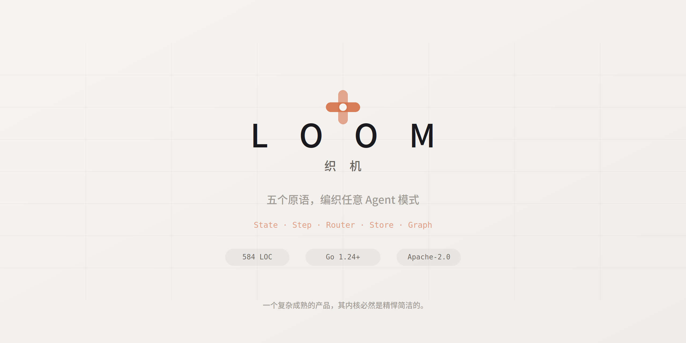

<p align="center">
  
</p>

---

织布机只有三个部件——经线、纬线、梭子——却能织出任何图案。

Loom 是同样的思路。整个内核 584 行代码，5 个类型定义。但它们组合起来，能表达从单轮聊天到百 Agent 编排的一切模式。

```go
type State  map[string]any                                           // 数据流
type Step   func(ctx context.Context, state State) (State, error)    // 计算
type Router func(ctx context.Context, state State) (string, error)   // 控制流
type Store  interface { Get; Put; Delete; List; Tx }                 // 持久化
type Graph  struct { steps; routers; Run(); Resume() }               // 编排
```

没有 `Agent` 类。没有 `Chain` 抽象。没有 `Memory` 基类。

一切高级功能从这五个原语**组合**而来，而不是从框架**继承**而来。

## 为什么做 Loom

市面上不缺 Agent 框架。缺的是一个你能真正**驾驭**的。

大多数框架做得很完整——几万行代码，完善的抽象层，丰富的内置功能。但如果你想改它的行为、理解它的运行机制、或者把它嵌入到你自己的系统里，你会发现你在跟一个庞然大物搏斗。

Loom 的设计原则是反过来的：**内核小到你能在一个下午读完全部源码。** 不是因为功能少，是因为一个复杂成熟的系统，其内核必然是精悍简洁的。复杂性应该从组合中涌现，而不是在框架里预制。

## 30 秒上手

```go
package main

import (
    "context"
    "fmt"
    "github.com/jinyitao123/loom"
)

func main() {
    greet := func(_ context.Context, s loom.State) (loom.State, error) {
        return loom.State{"output": "Hello, " + s["name"].(string) + "!"}, nil
    }

    g := loom.NewGraph("greeter", "greet")
    g.AddStep("greet", greet, loom.End())

    result, _ := g.Run(context.Background(), loom.State{"name": "World"}, nil)
    fmt.Println(result.State["output"]) // Hello, World!
}
```

```bash
go get github.com/jinyitao123/loom
```

## 五个原语能做什么

<table>
<tr>
<td width="50%">

**带工具的 Agent**

三个 Step 串起来。

</td>
<td>

```go
g := loom.NewGraph("agent", "guard")
g.AddStep("guard", guardStep, Always("chat"))
g.AddStep("chat",  toolLoop,  End())
```

</td>
</tr>
<tr>
<td>

**暂停等人类审批**

Step 返回 `__yield: true`，Graph 自动冻结状态。
人类批准后 `Resume()` 从断点继续。

</td>
<td>

```go
result, _ := g.Run(ctx, input, store)
// result.StopReason == "yielded"

// 人类审批后
result, _ = g.Resume(ctx, result.RunID,
    State{"approved": true}, store)
```

</td>
</tr>
<tr>
<td>

**10 个 Agent 协作**

每个 Agent 是一个 Graph，嵌进父 Graph。
共享 checkpoint，共享 step budget。

</td>
<td>

```go
parent := loom.NewGraph("orchestrator", "dispatch",
    WithStepBudget(500))

parent.AddStep("dispatch", router, Branch(...))
parent.AddStep("analyst", SubGraphStep(analystGraph), ...)
parent.AddStep("coder",   SubGraphStep(coderGraph),   ...)
```

</td>
</tr>
<tr>
<td>

**进程崩了？**

不用做任何事。每步自动 checkpoint 到 PostgreSQL。
重启后 `Resume()` 从断点继续，不丢一步。

</td>
<td>

```go
// 崩溃前：A → B → C ✓ → [crash]
// 重启后：
result, _ = g.Resume(ctx, runID, State{}, pgStore)
// 从 D 继续，C 的状态完整保留
```

</td>
</tr>
</table>

## 内核刻意不知道的事

这是 Loom 最重要的设计决策。

| 内核不知道 | 所以你可以 |
|---|---|
| LLM 是什么 | 用 OpenAI、Claude、DeepSeek、本地模型——Step 里随便换 |
| MCP 是什么 | 工具协议随便接，MCP / A2A / 自定义 RPC 都行 |
| Memory 怎么存 | RAG、图数据库、全文检索——State 里放什么是你的事 |
| HTTP 怎么服务 | Gin、Echo、net/http 都行——Loom 是库，不是服务 |

内核只管一件事：**按 Graph 定义的顺序执行 Step，沿途 checkpoint，遇到 yield 就暂停。**

剩下的全是你的事。这是自由，不是缺失。

## 架构

```
┌──────────────────────────────────────────────────┐
│  Layer 3 · Your App                              │  ← HTTP / Auth / 多租户 / 你的业务
├──────────────────────────────────────────────────┤
│  Layer 2 · Stdlib                    ~1800 LOC   │  ← 预制积木：ToolLoop / Guard / Handoff
├──────────────────────────────────────────────────┤
│  Layer 1 · Contract                   ~300 LOC   │  ← 纯接口：LLM / ToolDispatcher / Embedder
├──────────────────────────────────────────────────┤
│  Layer 0 · Kernel                     ~600 LOC   │  ← 五个原语，仅此而已
└──────────────────────────────────────────────────┘
```

**依赖规则：Layer N 只能 import Layer N-1 及以下。没有例外。**

## Stdlib

标准库里的每个组件都是 Step 或 Router 的组合。没有新原语，没有特殊通道。

```go
// ToolLoop：LLM 调用 → 工具执行 → 结果回传 → 循环直到完成
chat := stdlib.NewToolLoopStep(llm, tools, stdlib.ToolLoopOpts{
    MaxIterations: 20,
    Compaction:    &compactionPolicy,
    ToolHooks:     []contract.ToolHook{auditHook},
})

// 声明式工具权限：deny 优先于 allow
safeTool := stdlib.NewPermissionDispatcher(tools,
    []string{"rm_rf", "drop_table"},   // 永远禁止
    []string{"read_*", "search_*"},    // 只允许这些
)

// 跑到 $5 自动停
g.SetHooks(loom.HookPoints{
    After: []loom.StepHook{stdlib.CostBudgetHook(5.00)},
})
```

Read-only 工具自动并发，stateful 工具严格串行。ToolLoop 读 `ToolDef.ReadOnly` 标记自动判断。

## 项目结构

```
loom/
├── graph.go          执行引擎：State × Step × Router → Run / Resume
├── state.go          可注册合并策略的类型化 map
├── step.go           type Step func(ctx, State) (State, error)
├── router.go         控制流原语：Always / Branch / Condition
├── store.go          5 方法持久化接口
├── options.go        GraphOption：merge / checkpoint / budget
├── memstore.go       内存 Store（测试用）
│
├── contract/         纯接口层：LLM / ToolDispatcher / Embedder
├── stdlib/           预制 Step & Hook
│   ├── toolloop.go   LLM ↔ Tool 循环
│   ├── steps.go      Guard / HumanWait / SubGraph / Handoff
│   ├── permission.go 声明式工具权限
│   ├── budget.go     Token & 美元预算控制
│   ├── prompt.go     分层 prompt 组装
│   └── session.go    会话历史持久化
│
├── pgstore/          PostgreSQL Store
└── provider/         LLM Provider（OpenAI / DeepSeek）
```

## 对比

| | Loom | LangGraph | OpenAI Agents SDK |
|---|---|---|---|
| 语言 | Go | Python | Python |
| 内核 | ~600 LOC | ~15K LOC | ~3K LOC |
| 持久化 | 自动 checkpoint | 自动 checkpoint | 无 |
| LLM 耦合 | 零 | 中 | 强（OpenAI 绑定） |
| 工具协议 | 任意 | LangChain Tools | function calling |
| 子图嵌套 | 原生 | 原生 | 不支持 |
| 人机协同 | yield / resume | interrupt | 有限 |
| 可嵌入 | 是（Go 包） | 否（Python 服务） | 否（Python 服务） |

## 适合谁

- 需要 **crash recovery** 的长时间运行 Agent
- 需要 **人机协同** 的企业工作流
- 需要 **多 Agent 编排** 但不想引入重量级框架
- 需要 **预算控制** 防止 Agent 烧钱失控
- 需要在 **Go 生态** 中嵌入 Agent 能力

## License

Apache-2.0

---

<p align="center">
  <sub>一个复杂成熟的产品，其内核必然是精悍简洁的。</sub>
</p>
