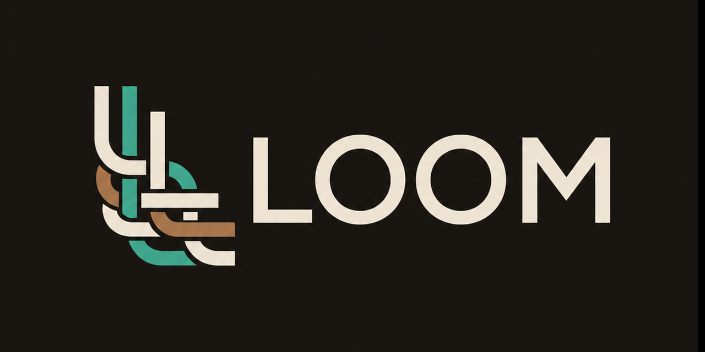

<p align="center">
  
</p>

<p align="center">
  <a href="README.md">English</a> | <a href="README.zh-CN.md">中文</a>
</p>

---

A loom has only three moving parts — warp, weft, shuttle — yet it can weave any pattern.

Loom works the same way. The entire kernel is ~700 lines of Go and 5 type definitions. Combined, they express everything from a single chatbot to a hundred-agent orchestration.

```go
type State  map[string]any                                           // data
type Step   func(ctx context.Context, state State) (State, error)    // compute
type Router func(ctx context.Context, state State) (string, error)   // control flow
type Store  interface { Get; Put; Delete; List; Tx }                 // persistence
type Graph  struct { steps; routers; Run(); Resume() }               // orchestration
```

No `Agent` class. No `Chain` abstraction. No `Memory` base type.

Every advanced feature is **composed** from these five primitives — not **inherited** from a framework.

## Why Loom

There is no shortage of agent frameworks. What's missing is one you can actually **own**.

Most frameworks are feature-complete — tens of thousands of lines, rich abstraction layers, batteries included. But when you need to change their behavior, understand their internals, or embed them into your own system, you find yourself wrestling a giant.

Loom's design principle is the inverse: **the kernel is small enough to read in an afternoon.** Not because it does less, but because a mature, complex system must have a lean core. Complexity should emerge from composition, not be pre-baked into the framework.

This is more than an engineering aesthetic. A kernel you can read is a kernel you can **govern**. Because an agent in Loom is a graph of explicit steps over an inspectable `State` — not a loose prompt loop — its execution is **deterministic and replayable**. And you can only safely hold someone accountable for what you can foresee and reconstruct. That property is the precondition for putting an agent to real work under human oversight: a steady, legible hand is the thing a governance layer can actually hold onto. [Weave](https://github.com/jinyitao123/Weave) is that layer — it builds the write-approval gate, the audit trail, and the addressable runtime on top of this kernel. Loom makes the hand steady; Weave decides which of its acts may reach the world.

## The control flow is data, not a guess

Most agent frameworks run a **prompt loop**: the model re-decides, every turn, what to do next. Flexible — but you can't foresee the path and you can't replay it; the same input can take two different routes.

In Loom the control flow is a **Graph** — an explicit structure of steps and routers, fixed *before* the run, not improvised during it. The graph owns the **how** (what runs, in what order); the prompt only supplies the **what** (the content, and the criteria for "good"). That single separation is what makes a Loom agent deterministic and replayable: same graph, same state, same path — with every step checkpointed, so you can reconstruct exactly what happened.

And because the flow is a *structure*, not a script, it is also **data**. A graph can be written in Go, or compiled from an agent spec that carries no code (`cmd/loom` does exactly this). Tools can then treat an agent as a versioned, diffable, portable document — while its execution stays exactly as predictable. That is the line between an agent you can put to supervised, consequential work and a chatbot that improvises: when a wrong turn can't be undone, you want the path decided, inspectable, and repeatable — you want a graph.

## 30-Second Quickstart

```go
package main

import (
    "context"
    "fmt"
    "github.com/jinyitao123/loom"
)

func main() {
    greet := func(_ context.Context, s loom.State) (loom.State, error) {
        return loom.State{"output": "Hello, " + s["name"].(string) + "!"}, nil
    }

    g := loom.NewGraph("greeter", "greet")
    g.AddStep("greet", greet, loom.End())

    result, _ := g.Run(context.Background(), loom.State{"name": "World"}, nil)
    fmt.Println(result.State["output"]) // Hello, World!
}
```

```bash
go get github.com/jinyitao123/loom
```

## What Five Primitives Can Do

<table>
<tr>
<td width="50%">

**Tool-calling Agent**

Three Steps, wired together.

</td>
<td>

```go
g := loom.NewGraph("agent", "guard")
g.AddStep("guard", guardStep, Always("chat"))
g.AddStep("chat",  toolLoop,  End())
```

</td>
</tr>
<tr>
<td>

**Pause for Human Approval**

A Step returns `__yield: true` and the Graph freezes state automatically. After approval, `Resume()` picks up right where it left off.

</td>
<td>

```go
result, _ := g.Run(ctx, input, store)
// result.StopReason == "yielded"

// After human approval
result, _ = g.Resume(ctx, result.RunID,
    State{"approved": true}, store)
```

</td>
</tr>
<tr>
<td>

**10 Agents Collaborating**

Each agent is a Graph, nested inside a parent Graph. Shared checkpoints, shared step budget.

</td>
<td>

```go
parent := loom.NewGraph("orchestrator", "dispatch",
    WithStepBudget(500))

parent.AddStep("dispatch", router, Branch(...))
parent.AddStep("analyst", SubGraphStep(analystGraph), ...)
parent.AddStep("coder",   SubGraphStep(coderGraph),   ...)
```

</td>
</tr>
<tr>
<td>

**Process Crashed?**

Nothing to do. Every step auto-checkpoints to PostgreSQL. After restart, `Resume()` continues from the last checkpoint. Not a single step lost.

</td>
<td>

```go
// Before crash: A → B → C ✓ → [crash]
// After restart:
result, _ = g.Resume(ctx, runID, State{}, pgStore)
// Continues from D, C's state fully preserved
```

</td>
</tr>
</table>

## What the Kernel Deliberately Doesn't Know

This is Loom's most important design decision.

| The kernel doesn't know | So you can |
|---|---|
| What an LLM is | Use OpenAI, Claude, DeepSeek, local models — swap freely inside a Step |
| What MCP is | Plug in any tool protocol — MCP / A2A / custom RPC |
| How to store memory | RAG, graph DB, full-text search — what goes in State is your call |
| How to serve HTTP | Gin, Echo, net/http — Loom is a library, not a service |

The kernel does one thing: **execute Steps in the order defined by the Graph, checkpoint along the way, pause on yield.**

Everything else is your domain. That's freedom, not omission.

## Architecture

```
┌──────────────────────────────────────────────────┐
│  Layer 3 · Your App                              │  ← HTTP / Auth / Multi-tenancy / Your business
├──────────────────────────────────────────────────┤
│  Layer 2 · Stdlib                    ~1500 LOC   │  ← Building blocks: ToolLoop / Guard / Handoff
├──────────────────────────────────────────────────┤
│  Layer 1 · Contract                   ~150 LOC   │  ← Pure interfaces: LLM / ToolDispatcher / Embedder
├──────────────────────────────────────────────────┤
│  Layer 0 · Kernel                     ~700 LOC   │  ← Five primitives. That's it.
└──────────────────────────────────────────────────┘
```

**Dependency rule: Layer N may only import Layer N-1 or below. No exceptions.**

## Stdlib

Every component in the standard library is a composition of Steps or Routers. No new primitives, no special channels.

```go
// ToolLoop: LLM call → tool execution → result → loop until done
chat := stdlib.NewToolLoopStep(llm, tools, stdlib.ToolLoopOpts{
    MaxIterations: 20,
    Compaction:    &compactionPolicy,
    ToolHooks:     []contract.ToolHook{auditHook},
})

// Declarative tool permissions, three levels: deny → ask → allow
safeTool := stdlib.NewPermissionDispatcherWithAsk(tools,
    []string{"rm_rf", "drop_table"},   // deny: always blocked
    []string{"send_email"},            // ask: executed with a user-confirmation hint
    []string{"read_*", "search_*"},    // allow: whitelist
)

// Auto-stop at $5
g.SetHooks(loom.HookPoints{
    After: []loom.StepHook{stdlib.CostBudgetHook(5.00)},
})
```

Read-only tools run in parallel automatically; stateful tools run serially. ToolLoop reads `ToolDef.ReadOnly` to decide.

## The `loom` CLI

Loom is a library first — but the repo also ships `loom`, a standalone agent engine built on that library. It is the [weave](https://github.com/jinyitao123/Weave) daemon's spawn-harness backend: prompt JSON on stdin, one agent turn, NDJSON events on stdout — with MCP tool servers, session resume, semantic memory, and deterministic sub-agent orchestration compiled from an agent spec.

```bash
# from a GitHub Release (linux / macOS):
curl -fsSL https://raw.githubusercontent.com/jinyitao123/loom/main/install.sh | sh

# or with Go (any platform):
go install github.com/jinyitao123/loom/cmd/loom@latest
```

See [cmd/loom/README.md](cmd/loom/README.md) for usage and the event wire format, and [docs/host-integration.md](docs/host-integration.md) for how any host process can drive it.

## Project Structure

```
loom/
├── graph.go          Execution engine: State × Step × Router → Run / Resume
├── state.go          Typed map with registrable merge policies
├── step.go           type Step func(ctx, State) (State, error)
├── router.go         Control flow: Always / Branch / Condition
├── store.go          5-method persistence interface
├── options.go        GraphOption: merge / checkpoint / budget
├── memstore.go       In-memory Store (for testing)
│
├── contract/         Pure interfaces: LLM / ToolDispatcher / Embedder
├── stdlib/           Pre-built Steps & Hooks
│   ├── toolloop.go   LLM ↔ Tool loop
│   ├── steps.go      Guard / HumanWait / SubGraph / Handoff
│   ├── permission.go Declarative tool permissions (deny / ask / allow)
│   ├── budget.go     Token & USD budget hooks
│   ├── prompt.go     Tiered prompt assembly
│   ├── session.go    Session history persistence
│   ├── specloader.go Agent-spec loading (identity / skills / sub-agents)
│   └── compiler/     AgentSpec → Graph: deterministic sub-agent orchestration
│
├── pgstore/          PostgreSQL Store
├── provider/         LLM Providers (OpenAI-compatible / DeepSeek)
├── cmd/loom/         The `loom` CLI — stdin JSON → agent turn → NDJSON stream
└── docs/             Host-integration contract & orchestration design
```

## Comparison

| | Loom | LangGraph | OpenAI Agents SDK |
|---|---|---|---|
| Language | Go | Python | Python |
| Kernel | ~700 LOC | ~15K LOC | ~3K LOC |
| Persistence | Auto checkpoint | Auto checkpoint | None |
| LLM coupling | Zero | Medium | Strong (OpenAI-bound) |
| Tool protocol | Any | LangChain Tools | function calling |
| Sub-graph nesting | Native | Native | Not supported |
| Human-in-the-loop | yield / resume | interrupt | Limited |
| Embeddable | Yes (Go package) | No (Python service) | No (Python service) |

## Who Is This For

- Long-running agents that need **crash recovery**
- Enterprise workflows that need **human-in-the-loop** approval
- **Multi-agent orchestration** without a heavyweight framework
- **Budget control** (token / USD) to prevent runaway agents
- Embedding agent capabilities in the **Go ecosystem**

## License

MIT

---

<p align="center">
  <sub>A mature, complex product must have a lean, precise kernel.</sub>
</p>
